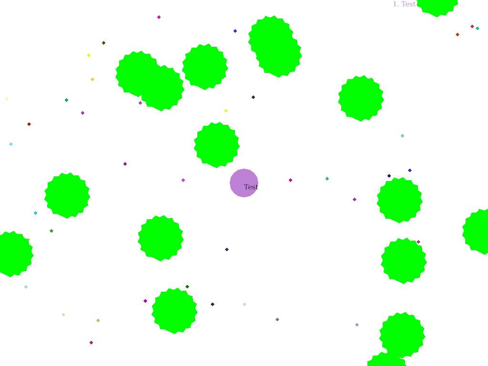

# ragar

A game like agar.io written in Rust with ggez



## Build
```sh
cargo build --release
```

## Run
### Host a server
```sh
./target/release/ragar_server
```

### Run game
```sh
./target/release/ragar
```

# TODO
- Virus
  - Number base on area.
  - Draw virus behind if ragarman is bigger.
- Split ragarman
  - Split when press `Space`.
  - Ragarman is push faster when be splitted.
  - Blow when eat virus.
  - Fusion.
- Game's configurable.
- Optimize
  - Draw.
  - Check if food is eaten.
- Start screen.
- Score board.
- Change connection to TCP.

# Support me
<a href='https://ko-fi.com/W7W5KWLN' target='_blank'></a>